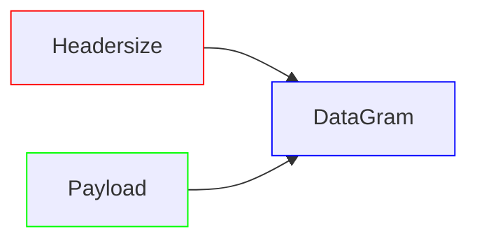

***

## Header format of IPv4

![[IPv4-Header-1.webp]]

 - #### Version
-> It tells about the version of the IP - Internet Protocol,whether its IPv4 or IPv6.
***

- #### Header Length
-> It tells about the length of the IP header.
```
header length = header length field value x 4bytes
```




A header size may be between ***20-60bytes = 160bits***
A payload size is = ***65535 - headerSize***

***

- #### Types of services
-> This tells the behaviour/services used by datagram,like precidence,delay,throughout,reliability,Differentiated Service Code Point(DSCP).


- -> Here p1,p2 and p3 defines the precidence that the what should be the priority of the datagram like it should be routine packet or an immediate packet.
- -> Here D referres to the delay that after how much time the datagram should be sent to the reciever.
- -> T referrs to the throughout.It means that more to more data should be sent in an datagram.
- -> R referres to the reliability like the packet should be delievered properly to the reciever.
- -> C referres to the cost with which the datagram is being sent.
- -> O is reserved currently and used by DSCP(differentiate Service Code Point)

*** 

- #### Total Length

-> It defines the total length of the datagram which means Header + Payload.

***

- #### Header Checksum

-> It helps in checking the header of the datagram.It checks each and every field in the header of IP.


