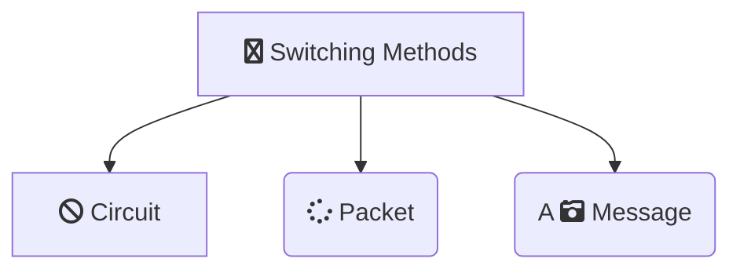
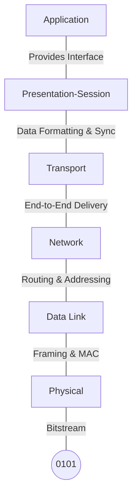

***
## What is computer networking?
-> *Computer networking means communication of two or more computer or devices on an network*

***
## Client Server **Model**

![[Client_Server_Model.jpg]]

#### How it works?
-> *The user sends an request to an server and server send and response to the user according to the request(we can also get the headers and other informations of the website/web server by using this model theory)*

***
## Type of servers 

##### File server - Stores files in the png,jpg and more like .html,.css,.js,.c etc.
##### Web Server - Server used to serve the webpages aka website to the client/user

***

## Type of Networking  Topology

- #### Ring Topology
- #### Star Topology
- #### BUS Topology

![[topology.jpg]]

***

## Physical Connection Devices

- Switch
- Hub
- Repeater
- Router
**This devices are used in the physical layer of networking**

***
## Switching
-> *Connection multiple nodes with each other on the network. The device used for this is switch(advance version of an hub).Topology Used*
#NOTE -> Node/host referres to an computer/device on an network

#### Message Switching
-> *Here the data over the network is send fully one time without breaking down the data into the form of blocks and switch also firstly gets the whole data and have to store it into the memory which will require more amount of switches and data*

![[messageSwitching.jpg]]

#### Circuit Swiching
-> *This type of switching method is used for real time communication like voice and video calls and sometimes SMS.The path is also established before connection*

#### Packet Switching
-> *In this type of switching the data is sent  in the form of packets and these can be sent between any path*.
#NOTE -> *MTU(Minimum Transmission Unit) it defines the maximum size of an data sent across network.*

***

## OSI Model(Open System Interconnection)

