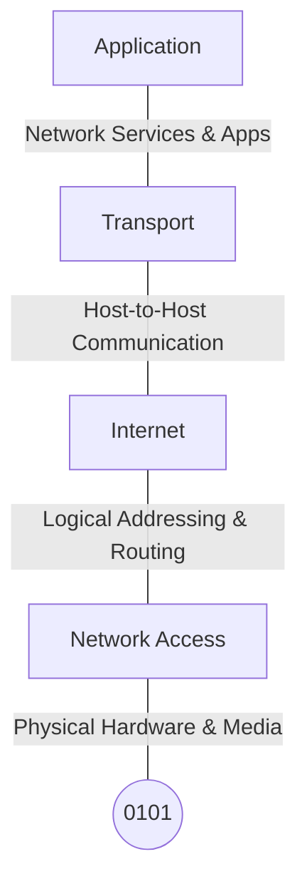

***

#### What is an TCP/IP model?

-> ***This model is the current internet artitecture.*** It consists of 4layers.Internet Protocol Version 4 ([IPv4](https://www.techtarget.com/whatis/definition/IPv4-address-class)) is the primary version used on the internet today. However, due to a limited number of addresses, a newer protocol [known as IPv6](https://www.techtarget.com/searchnetworking/answer/IPv4-vs-IPv6-Whats-the-difference) was developed in 1998 by the Internet Engineering Task Force ([IETF](https://www.techtarget.com/whatis/definition/IETF-Internet-Engineering-Task-Force)). IPv6 expands the pool of available addresses from IPv4 significantly and is progressively being embraced.

**This is how an IPv4 and IPv6 looks like->**
```
IPv4 -> 192.168.1.1
IPv6 -> 2001:0db8:85a3:0000:0000:8a2e:0370:7334
```



***

## Explanation of all layers

- #### 4 Application Layer(also consists of presentation and session layer)

   -> This layer consists of presentation and session layer also.It helps in generating data and then sending it to the lower layers.Decryption and encryption of data is also done here and session between two or more nodes is established here.
   
- #### 3 Transport Layer

  -> This layer helps in establishing the connection over an port between two or more nodes in an network and also defines the network methods used here like TCP,UDP etc.

- #### 2 Internet Layer(Network Layer)

   -> It converts the data into the form of packets and assign an destination ip address.

 - #### 1 Network Interface(Physical)

   -> It is the physical layer and the data is converted into the form of bits and then sent through electromagnetic signals.b 