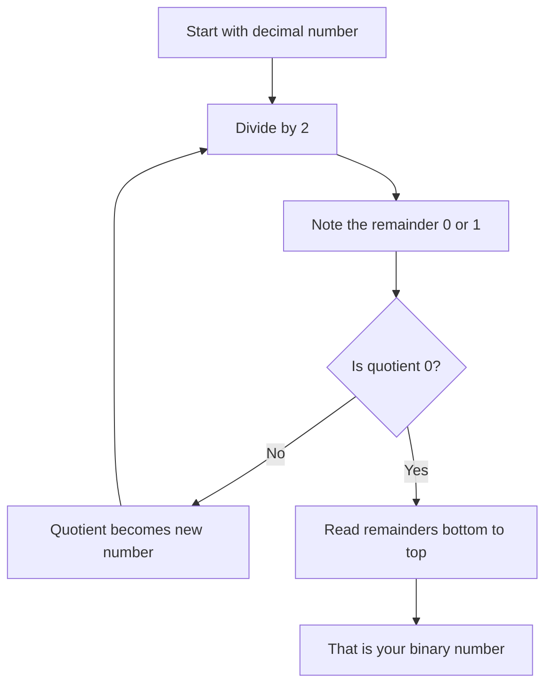
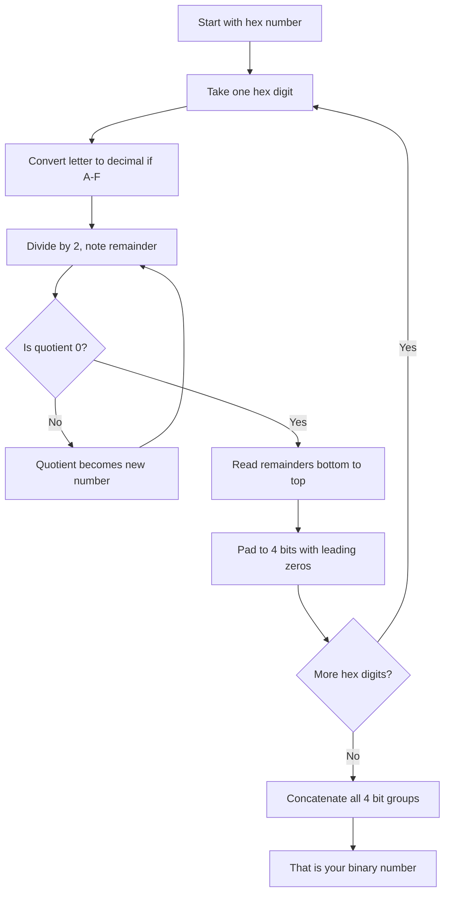
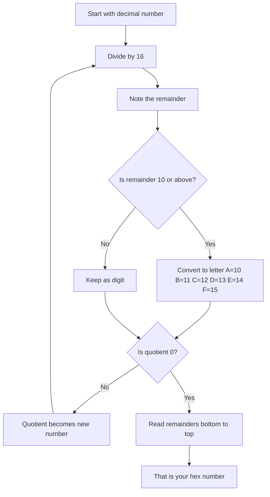

***

![[Pasted image 20260313140845.png]]


*Modern computers store and process information represented as 2-valued signals*

***

## **Three most important representations of numbers**

*We consider the three most important representations of numbers. **Unsigned***
***encodings** are based on traditional binary notation, representing numbers greater*
*than or equal to 0. Two’s-complement encodings are the most common way to*
*represent **signed integers**, that is, numbers that may be either positive or neg-*
*ative. **Floating-point encodings** are a base-two version of scientific notation for*
*representing real numbers*

***

*The computers use binary representations to encode numeric values.*

## `e` notation
*The `e` notation is used to give power to 10. For example 2e2.
2e2 means = 2 x 10<sup>2</sup> - 2 x 100 - 200
*

***

## Virtual Memories

*Every programm got its own virtual memory which lives in RAM.It means Virtual Memory is a place where the programm runs. And the `stack` and `heap` lives in the virtual memory.But one surprising thing is that programms think that they got full access to the RAM but the reality is they live in small part of ram.*

***

## Bits and bytes

*I am sure that you know about bit and bytes but I am going to tell you something memory allocation of different data types*

- int - **4bytes**
- char - **1byte**
- size_t - **8bytes**

***There are many more you can find out about it online***

***

*A byte can hold numbers till 00000000<sub>2</sub> - 11111111<sub>2</sub> which are equal to `255`.*

***

## Converting decimal into binary



#### For example
```
13 ÷ 2 = 6  remainder 1  ← last digit
6  ÷ 2 = 3  remainder 0
3  ÷ 2 = 1  remainder 1
1  ÷ 2 = 0  remainder 1  ← first digit

Final Result -> 1011
```

***

### Hex to binary

*Hexdecimal consists of 0-9 and a-f. Which are 16total and hence its called base16.The memory address of an variable in ram is also an hexadecimal which looks like `0x353af`.
Here `0x` contributes 0 bytes , `0x`,it just sets prefix that next elements will be hexadecimals.*
***One hex -> 4bits/A half bit***




#### Example

## Hex to Binary — 0xAF

**Step 1 — Take one hex digit at a time**
Start with **A** → convert to decimal → A = 10

**Step 2 — Convert A to binary**

| Division | Quotient | Remainder |
|----------|----------|-----------|
| 10 ÷ 2 | 5 | 0 |
| 5 ÷ 2 | 2 | 1 |
| 2 ÷ 2 | 1 | 0 |
| 1 ÷ 2 | 0 | 1 |

Read remainders bottom to top → pad to 4 bits → **1010**

**Step 3 — Convert F to binary**
F → 15 in decimal

| Division | Quotient | Remainder |
|----------|----------|-----------|
| 15 ÷ 2 | 7 | 1 |
| 7 ÷ 2 | 3 | 1 |
| 3 ÷ 2 | 1 | 1 |
| 1 ÷ 2 | 0 | 1 |

Read remainders bottom to top → **1111**

**Step 4 — Concatenate**

| Hex | A | F |
|-----|------|------|
| Binary | 1010 | 1111 |

**Result: 10101111**

***

## Converting decimal to hex 

*Decimals are our base10(0-9).So to convert decimal into hex/base16 we have to divide from 16*




#### Decimal to Hex — Example: 219

**Step 1 — Divide by 16**

| Division | Quotient | Remainder | Hex Digit |
|----------|----------|-----------|-----------|
| 219 ÷ 16 | 13 | 11 | B |
| 13 ÷ 16 | 0 | 13 | D |

> Quotient hit 0 — stop.

**Step 2 — Read remainders bottom to top**

| Order | Remainder | Hex Digit |
|-------|-----------|-----------|
| First | 13 | D |
| Last | 11 | B |

**Result: 0xDB**

> 💡 Only remainders 10 and above get converted to letters A-F. The rest stay as digits.